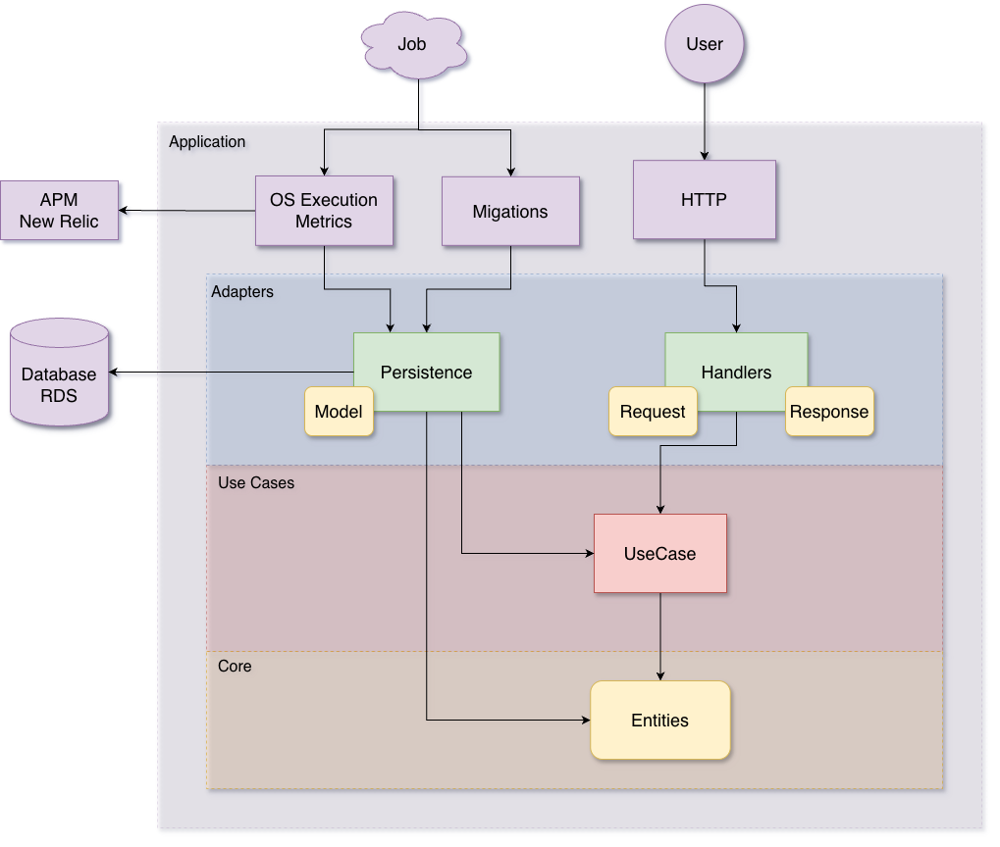
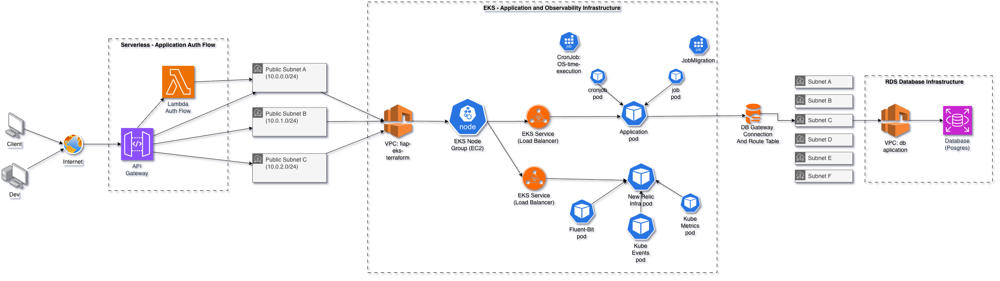

# OS Service API


## Descrição

O **OS Service API** é o microsserviço central responsável pela orquestração e gerenciamento completo do ciclo de vida das Ordens de Serviço (OS) na plataforma de oficina mecânica. Ele atua como o "cérebro" das operações, garantindo a integridade dos processos desde a recepção do veículo até a entrega final.

Suas principais responsabilidades incluem:

- **Gerenciamento de Ciclo de Vida da OS**: Controle dos estados da OS (Recebida, Diagnóstico, Aprovação, Execução, Finalizada, Entregue).
- **Gestão de Reparos Adicionais**: Controle de fluxo para inclusão de serviços ou peças extras identificados durante a execução, permitindo aprovação granular sem impactar o fluxo principal.
- **Cálculo e Gestão de Orçamentos**: Consolidação de valores de serviços (mão de obra) e insumos (peças), gerenciando versões e aprovações pelo cliente.
- **Orquestração de Integrações**: Atua como hub de integração com outros domínios:
  - **Entity Service**: Validação de clientes/veículos e gestão de reservas/baixas de estoque.
  - **Billing Service**: Processamento de pagamentos e faturamento.
  - **Execution Service**: Acompanhamento técnico da execução dos reparos.
  - **Notification Service**: Disparo de alertas de mudança de status para os clientes.


## Tecnologias Utilizadas

- Linguagem Go
- Web Framework Gin Gonic
- GORM ORM
- New Relic - Observabilidade, monitoramento e logging
- Swagger - Documentação
- Docker - Containerização
- SonarQube - Análise de qualidade

## Documentação da API

### Event Storming

Event Storming: <https://miro.com/app/board/uXjVIgU2y2I=/>

### Collection - Curls
Collection do **Insomnia** com as cURLs do projeto:

<!-- Add new collections -->

### Documentação Swagger

- Para gerar a documentação Swagger (a partir dos comentários no código):

  ```bash
  make swag-generate
  ```
  A documentação Swagger estará disponível em:  
`http://localhost:8080/swagger/index.html` enquanto a aplicação estiver rodando.

### Diagrama de Arquitetura



### Diagrama de Componentes


### Diagramas de Sequência
<details>
<summary>Ordem de serviço</summary>


</details>

<details>
<summary>Reparos adicionais</summary>


</details>

## Como executar localmente

### Pré-requisitos

- Golang 1.24.4 ou superior  
- Docker  
- Docker Compose  
- Make (para facilitar comandos via Makefile)

1. Clone o repositório:

   ```bash
   git clone <url-do-repositorio>
   ```

2. Navegue até o diretório do projeto:

   ```bash
   cd os-service-api
   ```

3. Inicialize o ambiente, que vai:
   - copiar o arquivo `.env.example` para `.env` (sem sobrescrever se já existir)
   - Instalação dos pacotes necessários
     ```bash
     go mod tidy
     ```
   - instalar o Swag CLI (se necessário)
   - gerar a documentação Swagger
     ```bash
     make swag-generate
     ```
   - subir os containers Docker (app e banco)
   - aguardar banco e app ficarem prontos
   - executar migrations e seeds

   Para isso, execute:

   ```bash
   make init
   ```

4. A aplicação estará disponível em `http://localhost:8080`

## Comandos úteis

- Para subir os containers (build + background):

  ```bash
  make up
  ```

- Para parar e remover os containers:

  ```bash
  make down
  ```

- Para acompanhar os logs do container da aplicação:

  ```bash
  make logs
  ```

## Testes

- Para rodar os testes automatizados dentro do docker:

```bash
make test
```

- Para rodar os testes e gerar relatório de cobertura (resumo no terminal):

```bash
make coverage

```

Para gerar e abrir o relatório de cobertura em HTML (abre no navegador):

```bash
make coverage-html
```

## Geração de imagem para testes de infraestrutura

Utilize o padrão de tags para versões de teste:

```
<imagem>:<versão>-[<descrição>-]test-<numero>
```

Exemplo:
```
os-service-api:1.0.0-test-01
```

Caso utilize o comando de `buildx` do docker para geração de uma imagem, utilize tags de plaform para criar versões multiarch (amd64 e arm64).
Caso use apenas o comando de `build`, a imagem será gerada multiarch pelas definições do Dockerfile.

**Para rebuildar uma imagem existente** do docker como multiarch (amd64 e arm64):

```bash
docker buildx build \
  --platform linux/amd64,linux/arm64 \
  -t docker.io/mandaapag03/os-service-api:<tag> \
  --push .
```
