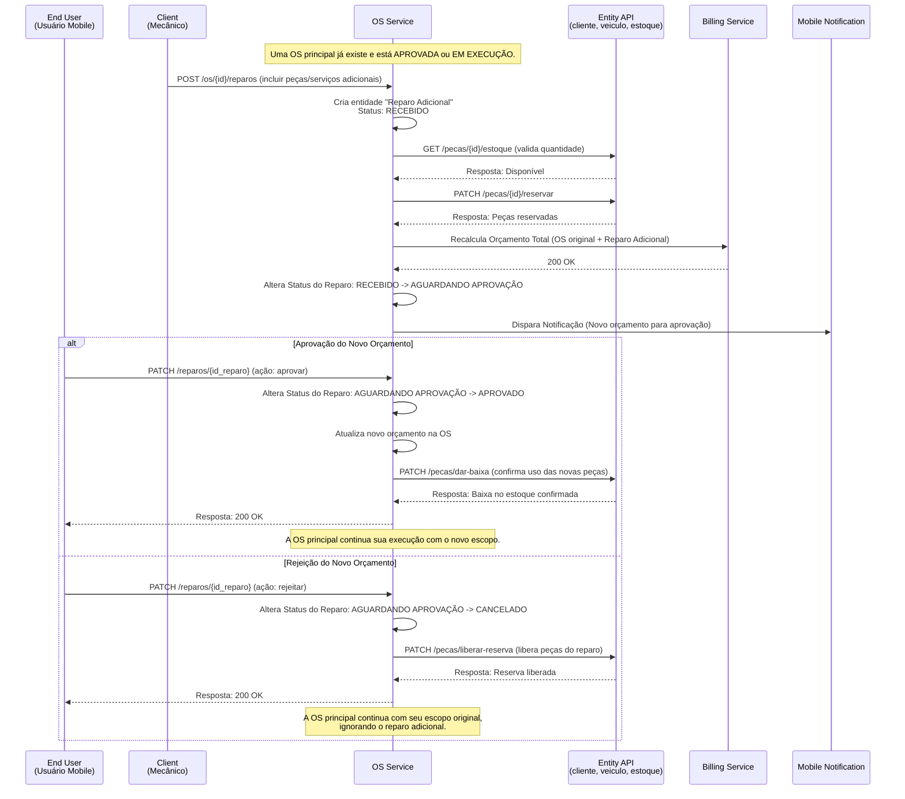

### Fluxo de Reparos Adicionais (AR)

### Descrição do Fluxo

#### Participantes
- **End User (Usuário Mobile)**: Cliente final que deve aprovar ou rejeitar o novo orçamento.
- **Client (Mecânico)**: Profissional que identifica a necessidade de reparo extra.
- **OS Service**: Gerencia o ciclo de vida do reparo adicional independente da OS principal.
- **Entity API**: Valida e reserva peças do estoque.
- **Billing Service**: Recalcula o orçamento total da OS considerando os novos itens.
- **Mobile Notification**: Notifica o cliente sobre a nova solicitação pendente.

#### Fluxos Principais

1. **Solicitação**: Mecânico adiciona novos serviços/peças a uma OS já em andamento.
2. **Reserva e Cálculo**: Sistema reserva itens e calcula impacto financeiro.
3. **Notificação**: Cliente é avisado de uma alteração no orçamento.
4. **Decisão**:
    - **Aprovação**: Baixa no estoque e atualização do valor da OS.
    - **Rejeição**: Liberação do estoque e cancelamento do reparo adicional.

#### Status do Reparo Adicional
- **RECEBIDO** (IN_ANALYSIS): Reparo criado, aguardando validações internas.
- **AGUARDANDO APROVAÇÃO**: Orçamento calculado e enviado ao cliente.
- **APROVADO**: Cliente aceitou o custo adicional.
- **CANCELADO**: Cliente rejeitou o reparo adicional.