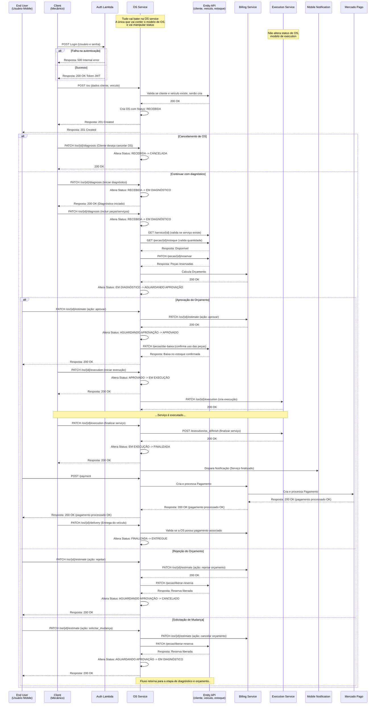

### Fluxo de Ordem de Serviço (OS)

### Descrição do Fluxo

#### Participantes
- **End User (Usuário Mobile)**: Cliente final que acompanha a OS pelo aplicativo mobile
- **Client (Mecânico)**: Profissional que executa o serviço
- **Auth Lambda**: Serviço de autenticação
- **OS Service**: Serviço principal que gerencia as ordens de serviço e seus status
- **Entity API**: API de entidades (clientes, veículos, estoque)
- **Billing Service**: Serviço de cobrança e orçamento
- **Execution Service**: Serviço de execução (não altera status da OS)
- **Mobile Notification**: Serviço de notificações push
- **Mercado Pago**: Gateway de pagamento

#### Fluxos Principais

1. **Autenticação**: Mecânico faz login no sistema
2. **Criação da OS**: Registro inicial com dados do cliente e veículo
3. **Diagnóstico**: Identificação dos problemas e inclusão de peças/serviços necessários
4. **Orçamento**: Cálculo e apresentação do orçamento ao cliente
5. **Aprovação**: Cliente pode aprovar, rejeitar ou solicitar mudanças
6. **Execução**: Realização dos serviços aprovados
7. **Pagamento**: Processamento do pagamento via Mercado Pago
8. **Entrega**: Finalização e entrega do veículo ao cliente

#### Status da OS
- **RECEBIDA**: OS criada inicialmente
- **EM DIAGNÓSTICO**: Análise do veículo em andamento
- **AGUARDANDO APROVAÇÃO**: Orçamento enviado ao cliente
- **APROVADO**: Cliente aprovou o orçamento
- **EM EXECUÇÃO**: Serviços sendo executados
- **FINALIZADA**: Serviços concluídos
- **ENTREGUE**: Veículo entregue ao cliente
- **CANCELADA**: OS cancelada pelo cliente
