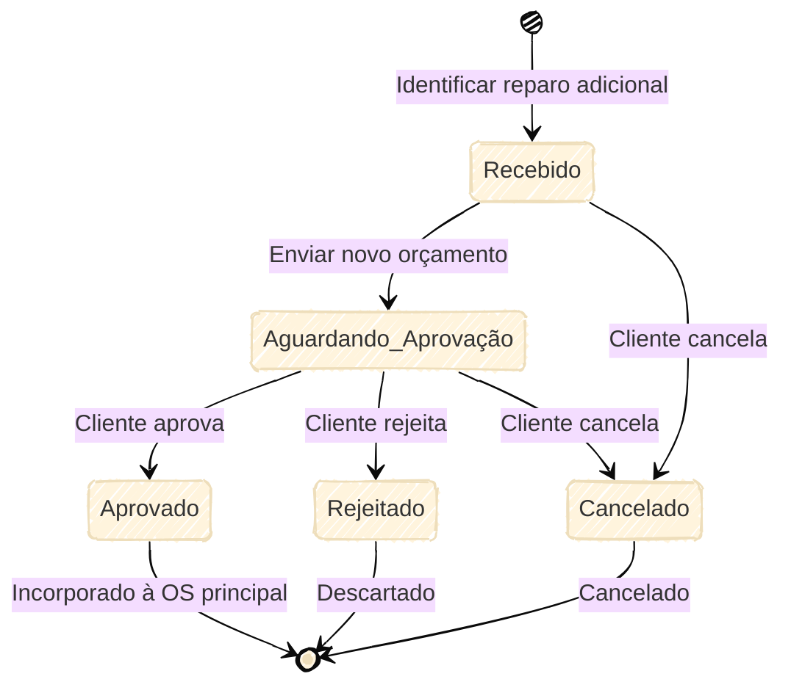

# Máquina de Estados - Additional Repair (AR)

```mermaid
---
config:
  layout: dagre
  theme: base
  look: handDrawn
---
stateDiagram
  direction TB
  [*] --> Recebido:Identificar reparo adicional
  Recebido --> Aguardando_Aprovação:Enviar novo orçamento
  Recebido --> Cancelado:Cliente cancela
  Aguardando_Aprovação --> Aprovado:Cliente aprova
  Aguardando_Aprovação --> Rejeitado:Cliente rejeita
  Aguardando_Aprovação --> Cancelado:Cliente cancela
  Aprovado --> [*]:Incorporado à OS principal
  Rejeitado --> [*]:Descartado
  Cancelado --> [*]:Cancelado
```
