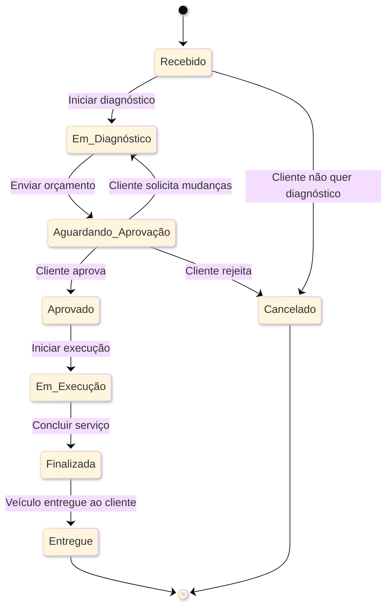

# Máquina de Estados - Service Order (OS)

```mermaid
---
config:
  theme: base
  look: neo
  layout: dagre
---
stateDiagram
  direction TB
  [*] --> Recebido
  Recebido --> Em_Diagnóstico:Iniciar diagnóstico
  Recebido --> Cancelado: Cliente não quer diagnóstico
  Em_Diagnóstico --> Aguardando_Aprovação:Enviar orçamento
  Aguardando_Aprovação --> Aprovado:Cliente aprova
  Aguardando_Aprovação --> Cancelado:Cliente rejeita
  Aguardando_Aprovação --> Em_Diagnóstico:Cliente solicita mudanças
  Aprovado --> Em_Execução:Iniciar execução
  Em_Execução --> Finalizada:Concluir serviço
  Finalizada --> Entregue:Veículo entregue ao cliente
  Entregue--> [*]
  Cancelado --> [*]
```
